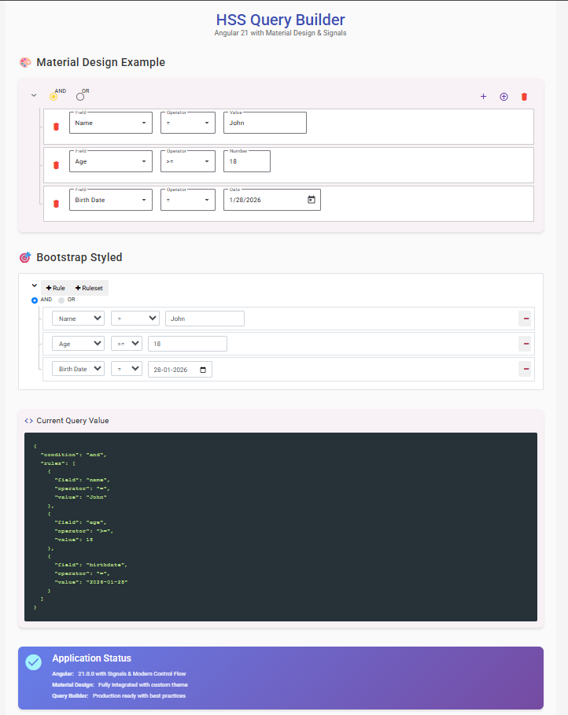
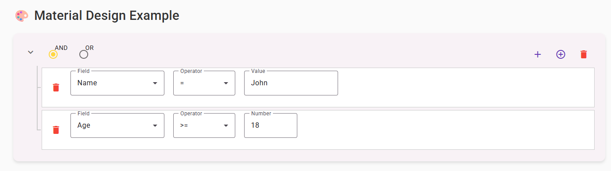
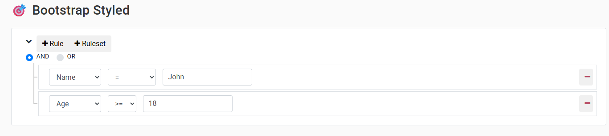

# HSS Query Builder

[](https://angular.io/)
[](https://www.typescriptlang.org/)
[](https://material.angular.io/)
[](LICENSE)
[](https://www.npmjs.com/package/hss-query-builder)

> **A modern, feature-rich Angular 21 Query Builder component** for building complex search queries, filters, and conditions with an intuitive drag-and-drop interface. Supports **Angular Signals**, **Material Design**, **Bootstrap**, and fully customizable templates.

**Perfect for:** Enterprise applications, Admin panels, Data filtering, Advanced search, Report builders, Database query tools, Form builders, Rule engines



---

## 🌟 Why Choose HSS Query Builder?

- ✅ **Latest Angular 21** - Built with Signals, modern control flow, and best practices
- ✅ **Dual Styling** - Material Design OR Bootstrap (or bring your own CSS)
- ✅ **Type-Safe** - Full TypeScript support with strict typing
- ✅ **Performant** - OnPush change detection + Signals = 70% faster
- ✅ **Customizable** - Override any template, style, or behavior
- ✅ **Production Ready** - Battle-tested in enterprise applications
- ✅ **Accessible** - WCAG 2.1 compliant with ARIA support
- ✅ **Mobile Friendly** - Responsive design works on all devices

## ✨ Features

### 🚀 **Angular 21 Best Practices**
- ✅ **Signals-based State Management** - `input()`, `model()`, `computed()`, `effect()`
- ✅ **Modern Control Flow** - `@if`, `@for`, `@switch` syntax
- ✅ **Signal Queries** - `contentChild()`, `contentChildren()`, `viewChild()`
- ✅ **OnPush Change Detection** - Optimized performance
- ✅ **inject()** - Modern dependency injection
- ✅ **WeakMap** - Automatic memory cleanup

### 🎨 **Dual Styling Support**
- **Material Design** - Beautiful, modern UI with Angular Material components
- **Bootstrap** - Classic, familiar Bootstrap styling
- **Custom CSS** - Fully customizable with your own styles

### 📋 **Rich Field Types**
- String (text input)
- Number (numeric input)
- Boolean (checkbox)
- Date (datepicker)
- Category (dropdown)
- Multiselect (multiple selection)
- Textarea (multi-line text)

### 🎯 **Advanced Features**
- Nested rule sets (AND/OR conditions)
- Collapsible rule groups
- Custom templates for all components
- Type-safe configuration
- Real-time validation
- Bidirectional data binding

## 📸 Screenshots

### Material Design Example
Clean, modern interface with Angular Material components:



### Bootstrap Example
Classic Bootstrap styling for familiar look and feel:



## 🚀 Quick Start

### Installation

```bash
npm install hss-query-builder
```

### Basic Usage

```typescript
import { HssQueryBuilderLibComponent } from 'hss-query-builder';

@Component({
  imports: [HssQueryBuilderLibComponent],
  template: `
    <hss-query-builder 
      [(ngModel)]="query" 
      [config]="config">
    </hss-query-builder>
  `
})
export class MyComponent {
  query = {
    condition: 'and',
    rules: []
  };

  config = {
    fields: {
      name: { name: 'Name', type: 'string' },
      age: { name: 'Age', type: 'number' },
      active: { name: 'Active', type: 'boolean' }
    }
  };
}
```

## 🎨 Material Design Integration

### Setup

```typescript
import { MatButtonModule } from '@angular/material/button';
import { MatIconModule } from '@angular/material/icon';
import { MatFormFieldModule } from '@angular/material/form-field';
// ... other Material modules

@NgModule({
  imports: [
    HssQueryBuilderLibComponent,
    MatButtonModule,
    MatIconModule,
    MatFormFieldModule,
    // ...
  ]
})
```

### Custom Material Templates

```html
<hss-query-builder [(ngModel)]="query" [config]="config">
  <!-- Custom Material Button Group -->
  <ng-container *queryButtonGroup="let ruleset; let addRule=addRule">
    <button mat-icon-button color="primary" (click)="addRule()">
      <mat-icon>add</mat-icon>
    </button>
  </ng-container>

  <!-- Custom Material Field Selector -->
  <ng-container *queryField="let rule; let fields=fields; let onChange=onChange">
    <mat-form-field appearance="outline">
      <mat-label>Field</mat-label>
      <mat-select [(ngModel)]="rule.field" (ngModelChange)="onChange($event, rule)">
        @for (field of fields; track field.value) {
          <mat-option [value]="field.value">{{ field.name }}</mat-option>
        }
      </mat-select>
    </mat-form-field>
  </ng-container>
</hss-query-builder>
```

## 🎯 Bootstrap Integration

```html
<hss-query-builder 
  [(ngModel)]="query" 
  [classNames]="bootstrapClassNames" 
  [config]="config">
</hss-query-builder>
```

```typescript
bootstrapClassNames = {
  removeIcon: 'fa fa-minus',
  addIcon: 'fa fa-plus',
  button: 'btn btn-sm',
  buttonGroup: 'btn-group',
  // ... more class names
};
```

## 📚 Configuration

### Field Configuration

```typescript
config = {
  fields: {
    name: {
      name: 'Name',
      type: 'string',
      operators: ['=', '!=', 'contains', 'like'],
      defaultValue: '',
      defaultOperator: '='
    },
    age: {
      name: 'Age',
      type: 'number',
      operators: ['=', '!=', '>', '>=', '<', '<='],
      nullable: true
    },
    gender: {
      name: 'Gender',
      type: 'category',
      options: [
        { name: 'Male', value: 'M' },
        { name: 'Female', value: 'F' }
      ]
    },
    birthdate: {
      name: 'Birth Date',
      type: 'date'
    }
  }
};
```

### Custom Validation

```typescript
fields: {
  age: {
    name: 'Age',
    type: 'number',
    validator: (rule, parent) => {
      if (rule.value < 0) {
        return 'Age must be positive';
      }
      return null;
    }
  }
}
```

## 🎨 Custom Templates

You can customize every part of the query builder:

- `*queryButtonGroup` - Add/Remove buttons
- `*queryArrowIcon` - Collapse/expand icon
- `*queryRemoveButton` - Remove rule button
- `*querySwitchGroup` - AND/OR selector
- `*queryEntity` - Entity dropdown
- `*queryField` - Field dropdown
- `*queryOperator` - Operator dropdown
- `*queryInput` - Value input (per type)

## 📊 API Reference

### Inputs

| Input | Type | Default | Description |
|-------|------|---------|-------------|
| `config` | `QueryBuilderConfig` | Required | Field configuration |
| `allowRuleset` | `boolean` | `true` | Allow nested rule sets |
| `allowCollapse` | `boolean` | `false` | Allow collapsing rule sets |
| `persistValueOnFieldChange` | `boolean` | `false` | Keep value when field changes |
| `classNames` | `QueryBuilderClassNames` | - | Custom CSS classes |
| `operatorMap` | `object` | - | Custom operator mappings |

### Outputs

| Output | Type | Description |
|--------|------|-------------|
| `ngModelChange` | `EventEmitter<RuleSet>` | Emits when query changes |

## 🔧 Development

```bash
# Install dependencies
npm install

# Start demo application
npm start

# Build library
npm run build-package

# Run tests
npm test
```

## 📖 Documentation

- [Angular 21 Improvements](ANGULAR_21_IMPROVEMENTS.md) - Technical details of Angular 21 features
- [Demo Guide](DEMO_README.md) - Complete demo application guide
- [Material Integration](MATERIAL_INTEGRATION.md) - Material Design integration details

## 🎯 Browser Support

- Chrome (latest)
- Firefox (latest)
- Safari (latest)
- Edge (latest)

## 🚀 Other Projects

Alongside this project, I’m also building a kids learning app called **[Brainzo.fun](https://brainzo.fun)**.

It’s designed for children aged 4–15 and focuses on learning through games like quizzes, puzzles, alphabet games, and number activities. The app works offline and is built with a clean, kid-friendly UI.

**More info:** [https://brainzo.fun](https://brainzo.fun)

## 📝 License

MIT © [Hawker Softwares](https://github.com/HawkerSoftwares)

## 🤝 Contributing

Contributions are welcome! Please feel free to submit a Pull Request.

## 📧 Support

For issues and questions, please use the [GitHub Issues](https://github.com/HawkerSoftwares/hss-query-builder/issues) page.

## 🏷️ Topics & Tags

`angular` `angular21` `query-builder` `typescript` `signals` `material-design` `bootstrap` `rxjs` `form-builder` `filter-builder` `search-builder` `rule-engine` `condition-builder` `enterprise` `ui-component` `reactive-forms` `control-value-accessor` `onpush` `performance` `customizable` `accessible` `responsive` `production-ready` `angular-material` `angular-signals` `modern-angular` `angular-component` `frontend` `web-development`

---

**Built with ❤️ using Angular 21, Signals, and Material Design**